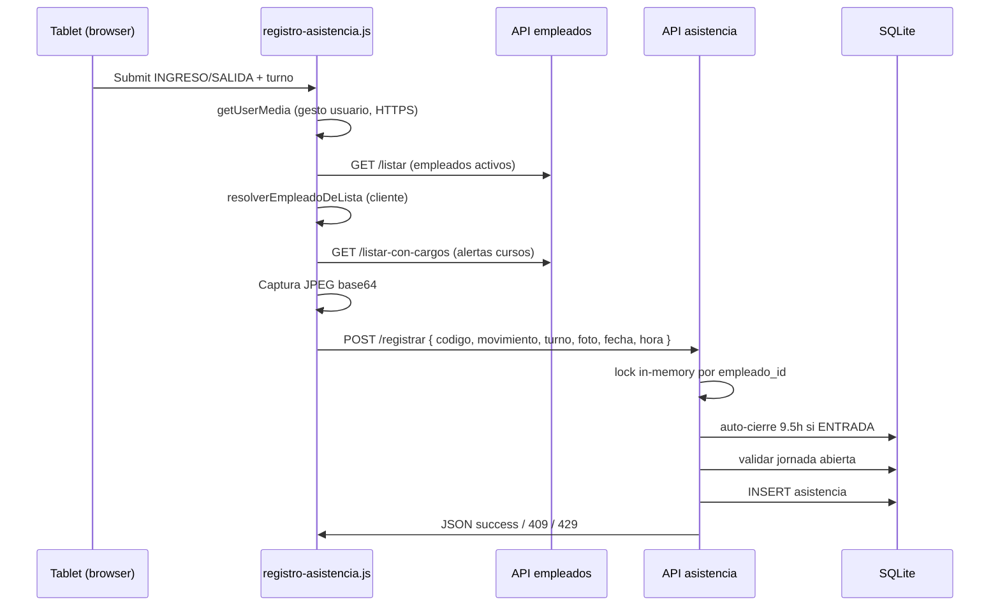

# Auditoría RHM — Módulo de Asistencia (checadas / kiosco / nómina)

**Alcance:** Sistema RHM (Node.js + Express + SQLite + frontend estático). Profundidad extra en asistencia; panorama breve del resto de RH.  
**Fecha de revisión:** 2026-09-19 (código en rama `main`, commits recientes hasta `ffa9ecf`).  
**Tipo:** Investigación y reporte priorizado — **sin rediseño ni cambios de comportamiento en este entregable.**

---

## Resumen ejecutivo (es-MX)

El área de asistencia concentra la mayor parte del dolor operativo porque mezcla **kiosco en tablet (cámara + HTTPS)**, **reglas de jornada en tiempo real**, **cierre automático a 9.5 h**, **fotos en base64 dentro de SQLite** y **cálculo de nómina** que reimplementa lógica parecida pero no idéntica a la del registro. Los parches recientes (sep 2026) atacan síntomas reales — salidas duplicadas por auto-cierre, jornada abierta, foto obligatoria, redondeo 15 min, turnos nocturnos en nómina, búsqueda por nombre — pero la base sigue siendo **monolito sin transacciones DB**, **locks solo en memoria de un proceso**, **fecha/hora como texto DD/MM/YYYY + 12 h** y **documentación desalineada (QR, offline)**.

**Hallazgo más urgente para operación admin:** varias pantallas de administración incluyen un error de plantilla HTML (`\`n` literal entre etiquetas ``n    <script src="../js/admin-auth.js">`` (backtick + `n` literal) |
| **Por qué falla en prod** | El navegador **no ejecuta** `admin-auth.js`. Sin wrapper de `fetch`, las llamadas a `/api/asistencia/listar`, DELETE y cortes automáticos van **sin** `Authorization: Bearer` → **401 Sesión inválida**. El admin percibe “asistencia rota” aunque el kiosco sí registre. |
| **Dirección de fix** | Sustituir la línea por dos etiquetas `<script>` válidas (como en `empleados.html`). Verificar en navegador red con token. **1 línea por archivo.** |

#### B2 — Endpoint de checada público sin autenticación

| | |
|---|---|
| **Dónde** | `POST /api/asistencia/registrar` en `asistencia.js`; `server.js` no aplica middleware |
| **Por qué falla en prod** | Cualquier cliente en la red puede registrar entrada/salida si conoce o adivina código MD5 de 8 caracteres; riesgo de punches falsos, sabotaje, empleado equivocado. |
| **Dirección de fix** | Token de kiosco por tablet, API key en header, o red VPN; rate limit por IP/código; opcional HMAC con nonce. No requiere rewrite: middleware delante de `/registrar`. |

#### B3 — Fecha/hora confiables: reloj del cliente manda

| | |
|---|---|
| **Dónde** | `obtenerFechaHoraRegistro` acepta `fecha`/`hora` del body; `registro-asistencia.js` siempre las envía |
| **Por qué falla en prod** | Tablet con TZ mal configurada o manipulación manual → punches en día/hora incorrectos; nómina y reportes divergen; difícil de auditar. |
| **Dirección de fix** | Servidor **siempre** timestamp autoritativo (`creado_en` + columnas ISO); ignorar hora cliente salvo modo admin corregir. |

---

### MAYORES

#### M1 — Emparejamiento entrada/salida inconsistente (LIFO vs FIFO)

| | |
|---|---|
| **Dónde** | `encontrarEntradasAbiertas` / registro salida (**LIFO**, `pop`) en `asistencia.js`; `emparejarEntradaSalida` (**FIFO**, `shift`) en `sueldos.js`; `encontrarEntradaParaSalida` (última entrada cronológica anterior) en listado admin |
| **Por qué falla en prod** | Con punches huérfanos (borrado admin, auto-cierre parcial, datos legacy), **horas en pantalla admin ≠ nómina**. |
| **Dirección de fix** | Extraer **un solo módulo** `lib/jornada.js` con una regla documentada (recomendado: LIFO = última jornada abierta). Reutilizar en asistencia, sueldos y listar. |

#### M2 — Locks solo en memoria del proceso

| | |
|---|---|
| **Dónde** | `locksEmpleado` en `asistencia.js`; `locksPago` en `sueldos.js` |
| **Por qué falla en prod** | Si algún día se escala PM2 `-i 2` o hay dos instancias, vuelven **dobles salidas / dobles pagos**. |
| **Dirección de fix** | Transacción SQLite `BEGIN IMMEDIATE` + unique constraint lógico, o lock en DB (tabla `locks`), o garantizar **una sola instancia** en deploy documentado. |

#### M3 — Registro sin transacción atómica

| | |
|---|---|
| **Dónde** | `POST /registrar`: múltiples `await dbRun` / lecturas separadas |
| **Por qué falla en prod** | Bajo contención WAL, ventana entre “leer abiertas” e `INSERT` permite estados imposibles pese al lock JS en un solo proceso. |
| **Dirección de fix** | Envolver en transacción; revalidar abiertas dentro de la misma transacción. |

#### M4 — Auto-cierre 9.5 h silencioso y sin foto

| | |
|---|---|
| **Dónde** | `cerrarJornadasAutomaticamente` |
| **Por qué falla en prod** | Empleado olvida salida → salida ficticia; conflicto con regla “foto obligatoria”; turno planta/nómina usa hora de salida sintética → **1.5 h planta** puede calcularse mal; reclamos en piso. |
| **Dirección de fix** | Marcar `movimiento=SALIDA_AUTO`, notificar push en kiosco siguiente día, excluir de reglas que requieren foto, revisar umbral 9.5 vs política real. |

#### M5 — Eliminación de checadas sigue permitida

| | |
|---|---|
| **Dónde** | `DELETE /api/asistencia/:id`, `admin-asistencia.js`; commit `ffa9ecf` solo evitó borrar al **pagar** nómina |
| **Por qué falla en prod** | Admin borra “duplicado” y deja entrada sin salida o viceversa → jornadas rotas, horas fantasma. |
| **Dirección de fix** | Soft-delete / anulación con motivo y auditoría; restringir rol; o bloquear DELETE y solo “ajuste” supervisado. |

#### M6 — HTTPS / cámara / certificado autofirmado

| | |
|---|---|
| **Dónde** | `server.js`, `registro-asistencia.js` (`esContextoSeguroParaCamara`), `deploy.sh` |
| **Por qué falla en prod** | Tablets sin certificado aceptado, o usuario abre `http://IP:3000` → **foto bloqueada** → checada imposible (400 foto obligatoria). Es la causa #1 histórica de “no jala asistencia”. |
| **Dirección de fix** | Runbook impreso: URL `https://IP:3000`, aceptar certificado; opcional túnel con cert válido; monitor que alerte si `USE_HTTPS=0`. |

#### M7 — Listado admin limitado a 500 registros con fotos embebidas

| | |
|---|---|
| **Dónde** | `GET /listar` `LIMIT 500`; SELECT incluye `foto` |
| **Por qué falla en prod** | Días con mucha planta → registros “invisibles”; página lenta; timeouts. |
| **Dirección de fix** | Paginación; endpoint `/foto/:id` separado; no cargar base64 en listado. |

#### M8 — Duplicación de lógica parseo fecha/hora y redondeo

| | |
|---|---|
| **Dónde** | `parsearFechaHora` + `redondearABloques15Minutos` duplicados en `asistencia.js` y `sueldos.js`; comentario en sueldos dice “hacia arriba” pero implementación es **al más cercano** (igual que asistencia) |
| **Por qué falla en prod** | Cualquier fix futuro en un archivo sin el otro reabre tickets de “horas mal en ticket vs nómina”. |
| **Dirección de fix** | `backend/lib/asistencia-tiempo.js` compartido + tests unitarios. |

#### M9 — Lista pública de empleados activos

| | |
|---|---|
| **Dónde** | `GET /api/empleados/listar` sin auth |
| **Por qué falla en prod** | Expone nombres y códigos a cualquiera en LAN; facilita fraude en `/registrar`. |
| **Dirección de fix** | Auth ligera de kiosco o lista cacheada firmada; mínimo rate limit. |

---

### MENORES

#### N1 — Documentación desactualizada (QR, offline, sync)

| | |
|---|---|
| **Dónde** | `README.md` |
| **Prod** | Expectativa QR/offline ≠ comportamiento → capacitación incorrecta. |
| **Fix** | Actualizar README o restaurar QR con flujo probado. |

#### N2 — Movimientos `INGRESO` vs `ENTRADA`

| | |
|---|---|
| **Dónde** | CHECK en DB permite ambos; UI solo envía `ENTRADA` |
| **Prod** | Datos legacy `INGRESO` complican filtros y reportes. |
| **Fix** | Normalizar en migración a un solo valor. |

#### N3 — Campo `area` obsoleto

| | |
|---|---|
| **Dónde** | Schema histórico Planta/GeoCycle; inserts `null` |
| **Prod** | Confusión en reportes viejos. |
| **Fix** | Documentar deprecación; quitar CHECK si aplica. |

#### N4 — Resolver empleado duplicado cliente/servidor

| | |
|---|---|
| **Dónde** | `frontend/js/resolver-empleado.js` y `backend/lib/resolver-empleado.js` |
| **Prod** | Drift si cambia uno; homónimos parciales sin elegir lista → 409 en servidor tras intento. |
| **Fix** | Solo validar en servidor; cliente solo autocompletar UI. |

#### N5 — `verificarFechasCursos` descarga todos los empleados con datos médicos

| | |
|---|---|
| **Dónde** | `registro-asistencia.js` → `/listar-con-cargos` |
| **Prod** | Payload grande en cada checada; expone campos de salud en cliente kiosco. |
| **Fix** | Endpoint `GET /empleados/:codigo/alertas` mínimo. |

#### N6 — Manejo HTTP débil en kiosco

| | |
|---|---|
| **Dónde** | `response.json()` sin comprobar `response.ok` |
| **Prod** | 502/504 muestran error críptico. |
| **Fix** | Mensajes por status. |

#### N7 — Filtro admin “Solo Entradas”

| | |
|---|---|
| **Dónde** | `listar` trata `ENTRADA` incluyendo `INGRESO` — correcto; UI no advierte legacy. |

#### N8 — `config.js` en localhost fuerza HTTP

| | |
|---|---|
| **Dónde** | `API_CONFIG` → `http://localhost:3000` |
| **Prod** | Dev sin HTTPS no reproduce bug de cámara. |
| **Fix** | Documentar dev con HTTPS local. |

---

### DEUDA

#### D1 — Modelo de datos: texto para instantes temporales

Migración futura a `timestamp_utc INTEGER` + `timezone_source` sin rewrite de UI: dual-write periodo.

#### D2 — Fotos en filesystem / object storage

SQLite no es almacén de blobs a escala.

#### D3 — Sin capa de dominio ni eventos

Toda la lógica en handlers Express → difícil testear y reutilizar.

#### D4 — Sin observabilidad

Solo `console.log`; no métricas de 409/429/400 foto.

#### D5 — Seguridad admin (password plano en DB)

`auth.js` — fuera de asistencia pero afecta confianza del sistema.

#### D6 — Eliminar empleado cascada borra asistencia histórica

`empleados.js` — impacto legal/auditoría.

---

## 4. Manejo de errores y mensajes al usuario

| Código | Mensaje típico | UX kiosco | Comentario |
|--------|----------------|-----------|------------|
| 400 | Foto obligatoria / turno inválido | Claro | Causa frecuente HTTPS/cámara |
| 404 | Empleado no encontrado | Claro | Tras fix nombre, menos frecuente |
| 409 | Jornada abierta / homónimos | Claro | Correcto fail-closed |
| 429 | Registro en proceso | Poco claro | Usuario puede reintentar en bucle |
| 401 | (Admin sin token) | “Error desconocido” en listar | Relacionado **B1** |
| 500 | Error SQL / servidor | Genérico | Falta correlación id en logs |

Mensajes positivos: ticket de salida con `tiempoTrabajado` 10 s en pantalla — buena práctica.

---

## 5. Integridad de datos (riesgos)

| Riesgo | Mecanismo | Severidad |
|--------|-----------|-----------|
| Punch perdido | Sin offline queue | Alta |
| Empleado equivocado | Nombre parcial / código compartido improbable (MD5 truncado) | Media |
| Día equivocado | Reloj tablet + texto fecha | Alta |
| Salida duplicada | Mitigado por lock + revalidación; no eliminado multi-instancia | Media |
| Entrada sin salida | Olvido + auto-cierre | Alta operativa |
| Horas nómina ≠ realidad | Auto-cierre, emparejamiento FIFO/LIFO, redondeo | Alta |
| Borrado admin | DELETE físico | Alta |
| DB corrupta / grande | Fotos base64 | Media-larga |

---

## 6. Acoplamiento nómina ↔ asistencia

1. **Consulta:** `fecha IN (...)` con rango extendido ±1 día (`fechasConsultaAsistencia`).
2. **Emparejamiento:** `emparejarEntradaSalida` + `agruparRegistrosPorDiaEntrada` + `resumenJornadaDelDia`.
3. **Reglas de negocio atadas a punches:** turno 1/3 prima, turno 4 ventana 16:30–18:00 (+1.5 h), domingo/festivo (`lib/laboral.js`), extras dobles/triples semanales, redondeo 15 min.
4. **Pago:** `POST /pagar` ya **no borra** asistencia (fix reciente); guarda snapshot en pagos.
5. **Fragilidad:** cambiar turno en kiosco sin entender nómina → pago incorrecto aunque checada “exitosa”.

---

## 7. Brechas de pruebas

| Estado | Detalle |
|--------|---------|
| **Eliminado** | `backend/scripts/test-asistencia-jornada.js` removido en `ffa9ecf` (existía en `f79b371`) |
| **No hay** | `npm test`, Jest, CI |
| **Manual implícito** | Scripts deploy / HTTPS |

**Pruebas mínimas recomendadas (sin rewrite):**

1. Emparejamiento: secuencias E-S, E-E-S, nocturno cruzando fecha, INGRESO legacy.
2. Auto-cierre 9.5 h no duplica salida si ya existe.
3. Concurrencia: dos POST paralelos mismo empleado → uno 429 o uno 409.
4. Parseo hora `a.m.` / `p.m.` variantes Android.
5. Contrato: horas ticket salida = horas nómina mismo par.

---

## 8. Parches recientes (contexto)

| Commit | Intención | Evaluación auditoría |
|--------|-----------|----------------------|
| `f79b371` | Anti duplicados, Date real auto-cierre, lock | Correcto en monoproceso; falta DB tx |
| `672c62e` | Foto salida + redondeo 15 m | Alinea con nómina en ticket |
| `671c6b3` / `4314cc9` | Quitar QR | Reduce fallos scanner; desalinea docs |
| `8861b01` | Cámara user-gesture | Patrón correcto Chrome tablet |
| `ffa9ecf` | Nombre, nómina nocturna/festivos, no borrar al pagar | Mejora sustancial; **eliminó tests**; no arregla HTML admin |

---

## 9. Recomendación estratégica

### Estabilizar primero (4–6 semanas de ingeniería incremental, no calendar estimate for agent)

1. **Hotfix B1** scripts admin (inmediato).
2. **Runbook M6** HTTPS tablets + verificación foto.
3. **Unificar M1/M8** emparejamiento y tiempo en `lib/`.
4. **Transacción + política M2/M3** (o documento “single instance PM2”).
5. **Restaurar tests** eliminados + casos nocturnos.
6. **Decisión producto M5/M4:** ¿borrar checadas? ¿auto-cierre visible?

### Rewrite completo del módulo — **no ahora**

Justificación: la complejidad está en **reglas laborales** y **emparejamiento**, ya parcialmente corregidas en `sueldos.js`. Reescribir sin módulo compartido y sin tests repite el ciclo de parches en producción.

Cuando estabilice:

- Modelo con timestamps normalizados (D1).
- Cola offline opcional solo si negocio lo exige (hoy no existe).
- QR opcional como **input de código**, no flujo separado.

---

## 10. Checklist accionable para orquestador

- [ ] Corregir `\`n` en HTML admin (B1)
- [ ] Validar panel asistencia con token en Network tab
- [ ] Confirmar PM2 instancias = 1 (M2)
- [ ] Capacitar URL HTTPS y certificado (M6)
- [ ] Extraer `lib/jornada.js` (M1/M8)
- [ ] Restaurar `test-asistencia-jornada.js` ampliado
- [ ] Decidir política DELETE punches (M5)
- [ ] Actualizar README (N1)
- [ ] Plan timestamp servidor autoritativo (B3)

---

## Referencias de código clave

- Registro y locks: `backend/routes/asistencia.js` (`POST /registrar`, `cerrarJornadasAutomaticamente`)
- Kiosco: `frontend/js/registro-asistencia.js`
- Admin listado/borrado: `frontend/js/admin-asistencia.js`
- Nómina: `backend/routes/sueldos.js` (`emparejarEntradaSalida`, `calcularSueldoSemanal`)
- Resolución empleado: `backend/lib/resolver-empleado.js`
- Schema: `backend/database/db.js` (tabla `asistencia`)
- Tareas periódicas: `backend/server.js`

---

*Documento generado por auditoría estática de código; validar en entorno de producción con logs PM2 y muestra de `database/rhr.db`.*
